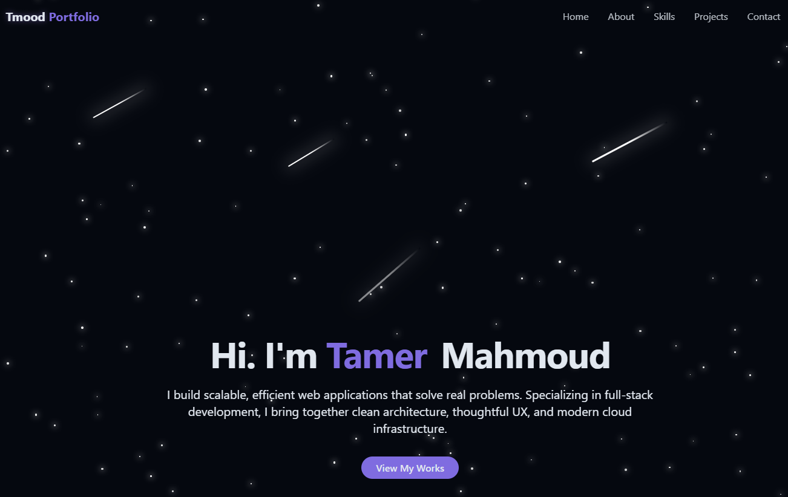
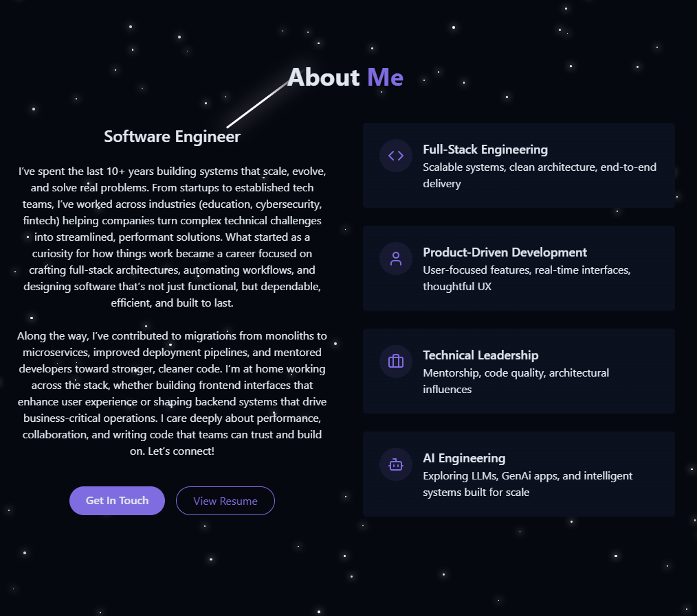
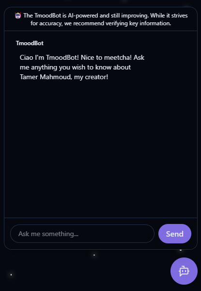

# 🤖 A Software Engineer Porfolio with AI Chatbot

A fully responsive developer portfolio built with React, Vite, and Tailwind CSS. It is designed for performance, responsiveness, and clean UI/UX, featuring a theme toggle, animated transitions, section-based navigation, and a starry animated background with occasional shooting meteors visible in dark mode. The site also includes a custom AI chatbot powered by OpenAI, Python, and embeddings, trained on my resume, GitHub, and LinkedIn to answer recruiter and developer-related questions in a conversational way.

---

## ✨ Features

- ⚡ Lightning-fast Vite + React front end
- 🤖 AI chatbot with custom embeddings from resume, LinkedIn, and GitHub
- 🌗 Theme toggle (light/dark)
- 📱 Responsive layout with TailwindCSS
- 🎨 Clean, modern design with animations
- 🧪 Knowledge base pipeline built in Python + Node.js

---

## 🔧 Tech Stack

<div align="center">

<table>
  <tr>
    <td align="center" width="240">
      <br/>React
    </td>
    <td align="center" width="240">
      <br/>Vite
    </td>
    <td align="center" width="240">
      <br/>Tailwind CSS
    </td>
    <td align="center" width="240">
      <br/>Node.js
    </td>
  </tr>
  <tr>
    <td align="center" width="240">
      <br/>JavaScript
    </td>
    <td align="center" width="240">
      <br/>Python
    </td>
    <td align="center" width="240">
      <br/>OpenAI API
    </td>
    <td align="center" width="240">
      <br/>Git
    </td>
  </tr>
</table>

</div>

---

## 💻 Running Locally

### 🧠 Run Knowledge Base Scripts

```bash
# 1. Create virtual environment
python -m venv venv

# macOS/Linux
source venv/bin/activate

# Windows (Git Bash / PowerShell)
source venv/Scripts/activate

# 2. Install dependencies
pip install openai tiktoken python-dotenv

# 3. Run scripts
node scrape_github.mjs           # Optional GitHub scraping
python combine_knowledge.py      # Combine all inputs
python embed_knowledge.py        # Embed into vector format
```

### 🚀 Run Frontend

```bash
# 1. Install dependencies
npm install

# 2. Run development server
npm run dev
```

Open browser at `http://localhost:5173`

---

## 🧾 Folder Highlights

| Folder            | Description                               |
| ----------------- | ----------------------------------------- |
| `/src`            | React components and layout               |
| `/api`            | Chat API handler for OpenAI calls         |
| `/knowledge_base` | Scripts and context files for the chatbot |
| `/public`         | Static assets                             |

---

## 🌐 Live Demo

### 👉 [View it live](https://vite-react-portfolio-lime.vercel.app/)

---

## 👀 Screenshots

<p float="left">
  
  
  
</p>

---

## 📫 Let’s Connect

<div align="center">

<table>
  <tr>
    <td align="center" width="260">
      <a href="https://linkedin.com/in/tmood" target="_blank">
        
      </a>
    </td>
    <td align="center" width="380">
      <a href="mailto:tamer.m.mahmoud@gmail.com">
        
      </a>
    </td>
  </tr>
</table>

</div>

